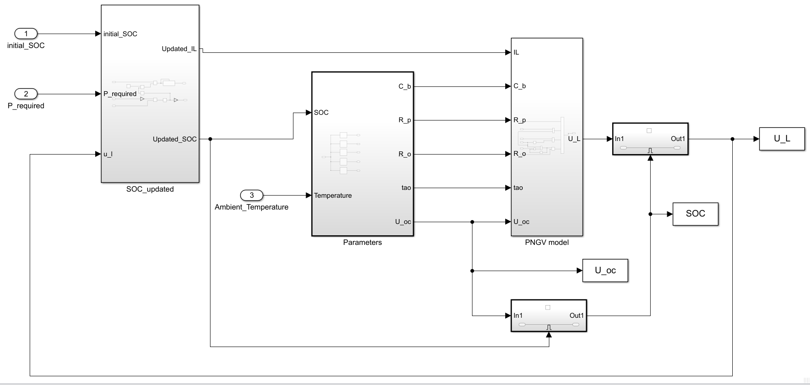

# Battery state of charge prediction based on machine learning algorithm

> Version 1.0 : Re-write the Electric vehicles and batteries simulation model, build a CNN-LSTM model for SOC prediction, the SOH is also considered.

## Cooperator
- Xin Chen: Supervisor
- Yuchen Zhang: SOC Prediction Model
- Siyuan Liang, Peiyuan Sun: Electric Vehicles Model
- Jiali Lu: Investigation


## Platform 
- Python: 3.x
- Pytorch: 0.4+
- Matlab: R2019a
- Simulink: 10.0

## SOC Prediction Model

Improve prediction accuracy and avoid the high errors near zero point by cutting off the parameter transfers between different batches of data

### Howto
1. Download `smallNewModelData` dataset from [here](https://github.com/Eurekwah/battery_state_prediction/tree/master/Python_code/Prediction_Model_v1/smallNewModelData)
2. Extract it like:
```shell
Prediction_Model_v1/
├── smallNewModelData
	├── soc01.csv  
	├── soc01.csv 
	...
├── main.py
    ├── SOC_v1.py
    ├── SOC_test_v1.py
    ├── Data.py
└── net_params.pkl
```
4. Modify the `path` to your actual data path
3. Run `main.py`

### Hyperparameters
```
EPOCHES     = 1500
RATE        = 8e-3
HIDDEN_SIZE = 48
Optimizer   = Adam
```

### The pretiction result
- SOC=83% RMSE=1.76%

- SOC=90% RMSE=1.88%


### Sturcture 
1. Run `main.py` to train the model
2. CNN-LSTM model is defined in `Soc_v1.py`
3. `Soc_test_v1.py` is for testing
4. `Data.py` is for data processing, but you don't need to run it
5. Parameter is in `net_params.pkl`


## Electric Vehicles Model

### Howto
1. Determine the weight, windward area, internal drive efficiency and the numbers of batteries of the simulation objects
2. Fill them into the corresponding position of the model
3. The speed and slope is also needed

### Vehicles Hardware Module

#### Structure

1. Operating input module
2. Automotive speed control module 
3. Torque conversion module 
4. Vehicle mechanics module 
5. Power conversion module 
6. Thermodynamics module

#### Function

- Get access to the simulation of the vehicle's inner situation under different working states which involve the variation of slope and velocity
- Figure out the specific power needed from the battery to support the vehicle's work and the 


- State of Charge

- Speed

- Current
 
- Voltage


### Battery Module
Use the PNGV model to descibe the port of the battery


#### Simulation (Initial SOC = 90%)
- State of Charge

- Temperature

- Terminal Voltage

- OCV-SOC
